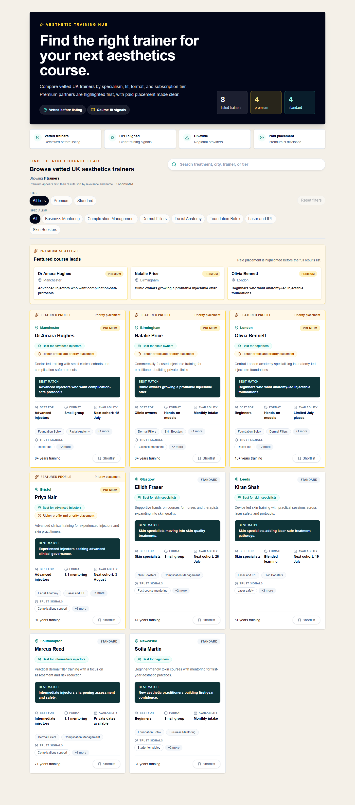
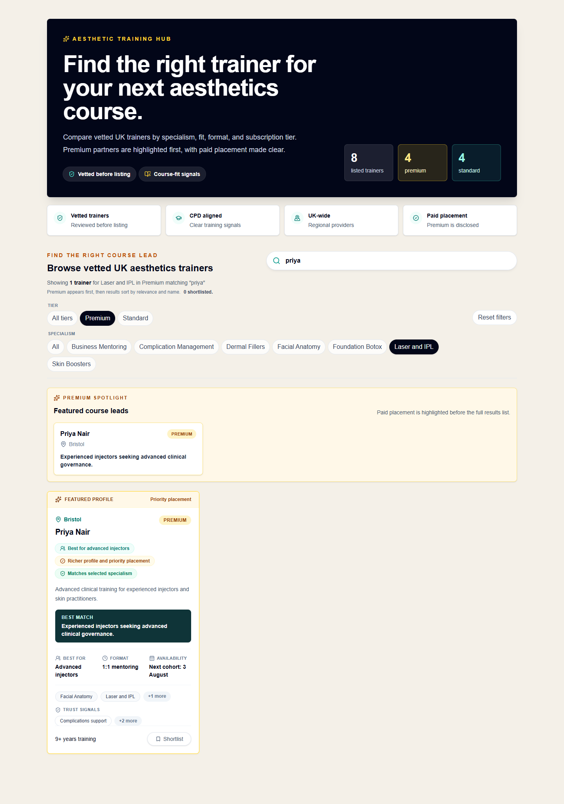
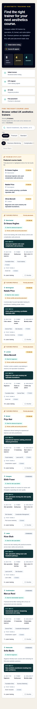

# Aesthetic Training Hub Directory

Public practitioner directory built for the EQUALS3 AI-Leveraged Full-Stack Developer test.

## Brief Coverage

This project implements the public directory slice for the Aesthetic Training Hub:

- Lists aesthetics trainers with name, specialisms, location, and subscription tier.
- Supports the two requested paid tiers: Standard and Premium.
- Makes Premium trainers stand out through ordering, visual treatment, and richer card emphasis.
- Lets students search and filter trainers by specialism and listing tier.
- Lets students shortlist trainers locally while comparing options.
- Includes populated seed data using a typed in-memory dataset.
- Uses Next.js, React, and TypeScript.

The implementation intentionally stays small because the brief asked for a clean, working slice rather than a larger unfinished product.

## Screenshots

### Directory



### Filtered Results



### Mobile Layout



## Tech Stack

- Next.js 16
- React 19
- TypeScript
- Tailwind CSS
- Lucide React icons
- Typed in-memory data

## How To Run

Install dependencies:

```bash
npm install
```

Run the development server:

```bash
npm run dev
```

Open `http://localhost:3000`.

Run local verification:

```bash
npm run lint
npm test
npm run build
```

Run the production build locally:

```bash
npm run start
```

The app expects Node `24.x`, pinned in `package.json`.

## Verification

Checked locally:

- `npm run lint`
- `npm test`
- `npm run build`
- Browser smoke test of the directory, search, specialism/tier filters, shortlist persistence, reset state, tier ordering, and mobile layout
- Playwright screenshot pass for desktop, filtered results, and mobile layouts

The automated tests cover ranking, specialism filtering, tier filtering, keyword search, combined filters, invalid URL parameter fallback, and empty-result behaviour.

## Design Decisions

Premium trainers are listed first and have stronger visual treatment because the paid tier needs a visible commercial benefit. I also added a ranking note in the UI because paid placement affects student trust and should not be hidden.

The visual direction is trust-first rather than decorative. The hero sets clear marketplace positioning, the trust strip reinforces vetting and transparency, and the compact cards expose concrete decision signals without overwhelming the directory.

The UI uses a stronger editorial hero, a search-led directory header, and a Premium spotlight rail to make the page feel more like a curated marketplace than a plain listing table.

Filtering is by specialism and listing tier. Specialism is the strongest student intent signal, while the tier filter makes the commercial distinction transparent and easy to inspect.

Search covers trainer names, locations, tiers, and specialisms. I kept this scoped to structured fields rather than free-text summaries so keyword matches are predictable for students.

The selected filters and search query are synced to the URL, for example `/?specialism=Laser%20and%20IPL&tier=premium&q=leeds`, so filtered directory states can be shared and reviewed directly.

The shortlist is stored in browser storage. It gives the slice a realistic comparison behavior without adding accounts, backend persistence, or a fake enquiry flow.

When a trainer is saved, a sticky shortlist bar confirms the saved state and offers a clear action to remove the local shortlist. This makes the comparison behavior visible without pretending a full compare flow exists.

The cards include decision-support fields such as best-fit audience, format, trust signals, and cohort timing. Longer tag lists are collapsed into "+ more" chips so students can scan results faster.

The data stays in a typed in-memory dataset because persistence, onboarding, subscription checks, and approval workflows would be outside the intended half-day slice.

## Product Management Notes

The product has two customers with different needs. Students need to find a trainer they can trust for a specific treatment area, location, format, and experience level. Trainers need enough visibility and lead quality to justify a recurring listing fee.

The main product tension is trust versus monetisation. Premium placement is commercially useful, but it can weaken the marketplace if students feel results are pay-to-win rather than relevant. I would keep paid placement visible, measure whether Premium listings still satisfy student intent, and define when relevance should override tier.

For this slice, I would judge success with:

- Profile click-through rate from directory cards.
- Search and filter usage rate.
- Shortlist creation rate.
- Enquiry or booking-start rate once CTAs exist.
- Zero-result searches and filters.
- Premium listing conversion and retention.

The next product questions I would answer before expanding the feature are:

- What does "vetted" mean operationally, and who approves or suspends listings?
- Is the paid tier buying ranking, richer profile fields, lead priority, analytics, or all of those?
- Is the primary conversion a profile view, enquiry, course booking, or trainer subscription?
- Should the directory list trainers, training providers, individual courses, or cohorts?
- What information is legally or commercially required before a student contacts a trainer?

Suggested roadmap:

- Phase 1: Public directory, Premium disclosure, search, filters, and shortlist.
- Phase 2: Trainer profile pages with credentials, course dates, outcomes, and enquiry CTAs.
- Phase 3: Admin approval workflow, subscription visibility rules, and trainer self-serve profile editing.
- Phase 4: Analytics-driven ranking, zero-result reporting, and Premium value reporting for trainers.
- Phase 5: AI-assisted canonical tagging and semantic search once moderation rules are in place.

## Progress Report

Built:

- A public directory page for vetted UK aesthetics trainers.
- Typed in-memory seed data for 8 fictional practitioners.
- Premium and Standard tiers, with Premium listings ordered first and styled as featured listings.
- Client-side filtering by specialism and tier using accessible filter chips.
- URL-synced keyword search across trainer name, city, tier, and specialism.
- A persistent local shortlist so students can save trainers while comparing results.
- Decision-support fields on each trainer card: best-fit audience, training format, trust signals, and cohort timing.
- A transparent ranking note explaining Premium placement and relevance sorting.
- Responsive card grid with result counts and a resettable empty state.
- Empty-state handling when no trainers match the selected specialism.
- Shareable URL state for selected specialism, tier, and search filters.
- Lightweight automated tests for ranking, search, and filtering behaviour.
- Accessibility polish including a skip link, labelled filter group, and keyboard-visible controls.
- Trust-first UI polish: stronger hero, trust strip, icon-led metadata, and richer Premium card treatment.
- UI/UX refinement: search-led header, Premium spotlight rail, compact trainer cards, sticky shortlist bar, tab-style filter bar, shorter ranking copy, and mobile-friendly card density.
- README screenshots generated with Playwright.
- Basic Open Graph/Twitter metadata and a polished marketplace-style UI.

Left out:

- Database persistence.
- Trainer profile detail pages.
- Admin onboarding or approval workflow.
- Stripe/subscription status checks.
- Enquiry, booking, or course comparison flows.
- Real LLM API integration.

What I would do next:

- Move practitioners into a database with subscription status, approval state, and canonical specialism tags.
- Add profile pages with trainer credentials, course dates, student outcomes, and enquiry CTAs.
- Define the ranking rules for Premium vs Standard listings so the commercial promise is explicit.
- Add a richer relevance model once there is real student behaviour data.
- Promote the shortlist into a proper compare/enquiry flow once accounts or lead capture exist.
- Add analytics for filter usage and profile click-through so the marketplace can learn what students need.
- Add component-level interaction tests and a small Playwright smoke test script for CI.

## Where The Brief Was Unclear

The biggest ambiguity is the word "practitioner". The product description says trainers list themselves and students discover them, but the task asks for a practitioner directory. Those could be the same entity, but in aesthetics they can mean different roles. I treated practitioners as trainers because that matches the marketplace model.

The tier rules are also underspecified. The brief gives prices for Standard and Premium, but not the benefits. I made Premium more prominent through ordering and visual treatment. In a real product I would want the commercial promise defined: always ranked first, larger cards, badges, lead routing priority, richer profiles, or some combination.

The ranking model needs a spec. If Premium always outranks Standard, the directory is commercially simple but may be less useful for students. If quality or relevance can outrank Premium, the business needs to explain what Premium actually buys.

I added a visible ranking note in the interface because paid placement versus student relevance is too important to leave implicit. In production I would want this agreed with the business before launch, especially in a trust-sensitive education marketplace.

The vetting model is central to trust but outside the brief. A real directory needs approval states, credential checks, insurance or qualification fields, and a way to remove or suspend listings.

The student journey after discovery is not defined. The next action could be enquiry, course booking, trainer profile view, or comparison. That decision affects the card content, ranking, and conversion metrics.

The data model is intentionally simplified. For a production marketplace I would want a clear distinction between trainer, training provider, course, location, cohort, subscription, and approval status. Combining those too early would make the directory harder to evolve.

The brief asks for a public directory but does not define what success means. I would want one primary metric agreed upfront, such as profile click-through, enquiry starts, course bookings, or trainer subscription conversion. That would change the UI priorities.

## Optional AI Note

I would not add an LLM call directly to this small slice. The highest-leverage use later would be behind the scenes: normalize trainer-entered specialisms into canonical tags, generate student-friendly summaries from approved profile data, and support semantic search such as "advanced filler complications near Manchester". Those uses should sit behind moderation because this is a regulated, trust-sensitive market.
